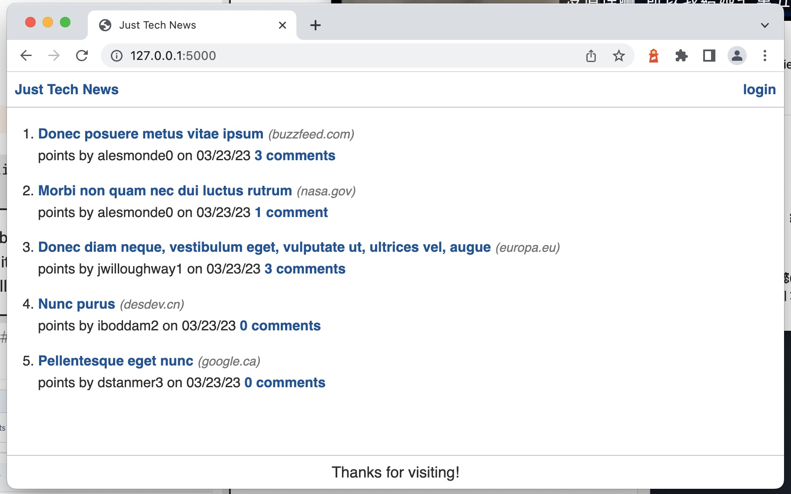
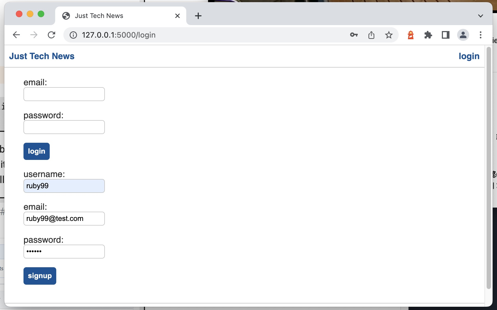
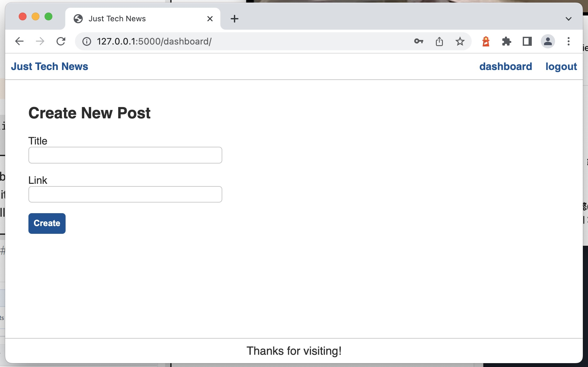
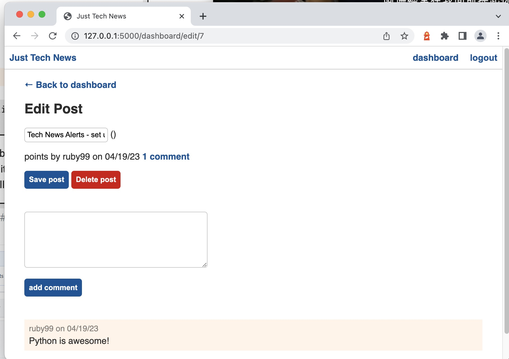
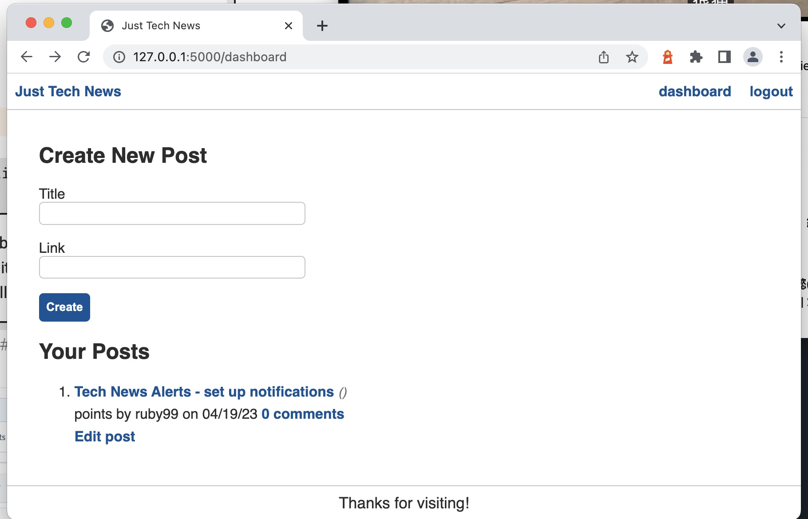
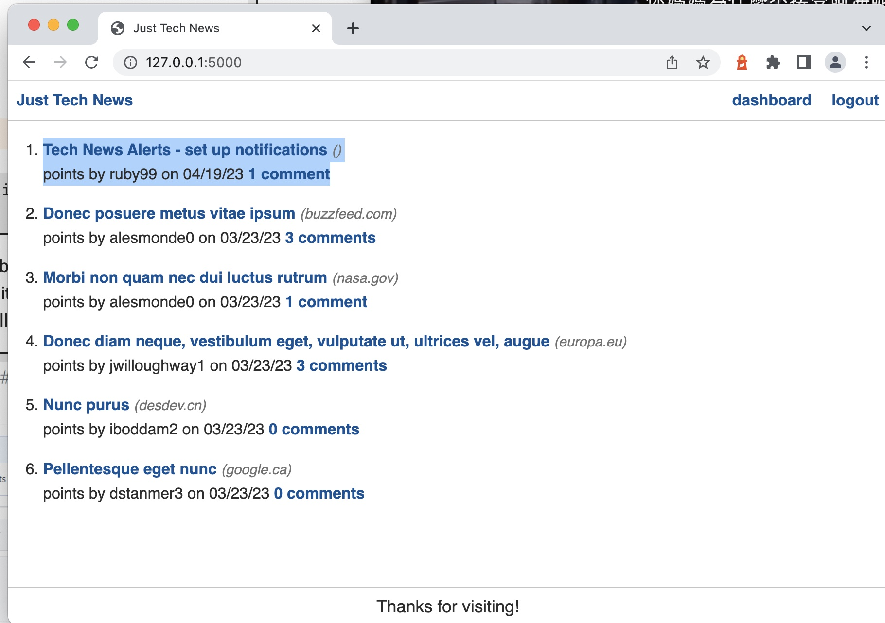

# Python Newsfeed

Link to Heroku Deployed site: [https://](https://)

## Description

This is a Tech Newsfeed application originally built using Node.js; refactored using Python. The purpose of this app is to build a website where users can post, upvote and comment on links to news articles.

## Table of Contents

- [Installation](#installation)
- [usage](#usage)
- [Contributing](#contributing)
- [Tests](#tests)
- [License](#license)
- [Questions](#questions)

## Installation

This app uses the Python framework Flask and connects to a relational database SQLAlchemy. User authorization uses Flask's built-in session functionality. Passwords are protected using bcrypt.

## Usage

1. Install necessary packages
2. In dev mode, run flask
3. Future developement - fix vote counts function

## License

Licensed under the [MIT](https://choosealicense.com/licenses/mit/) license

## Questions

If you have additional questions about the repo, you can contact me directly at conniehhw@gmail.com. You can find more of my work at conniehhw (https://github.com/conniehhw).
